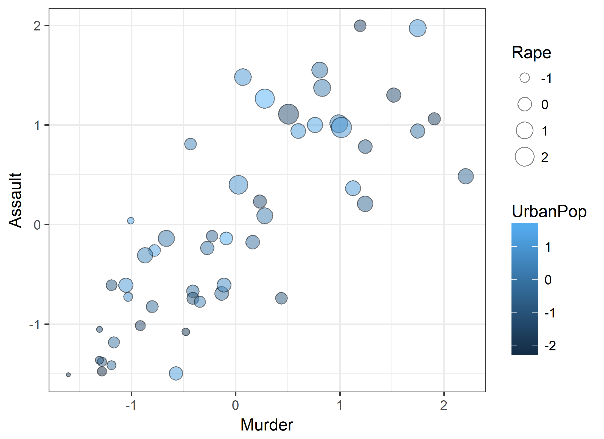
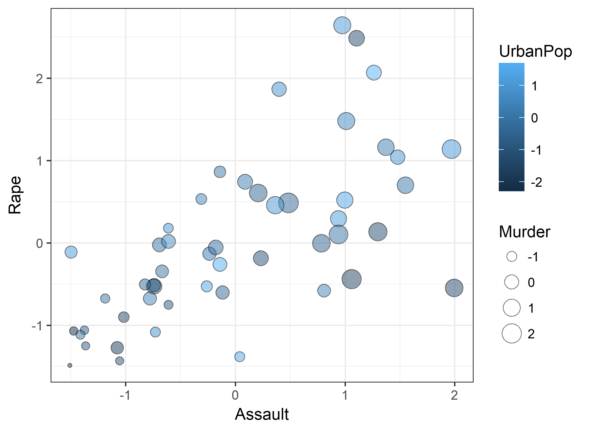
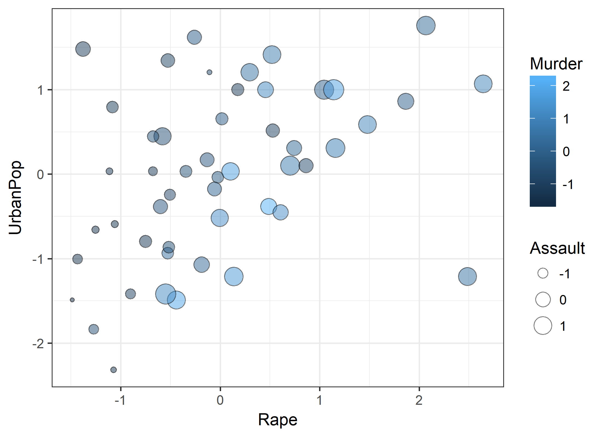
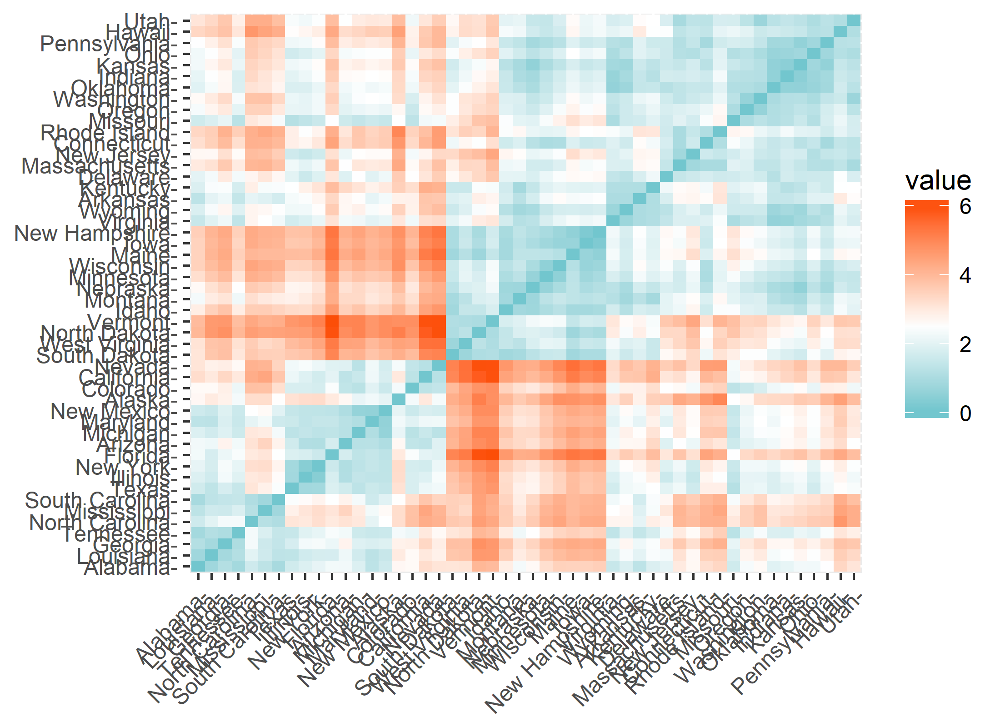
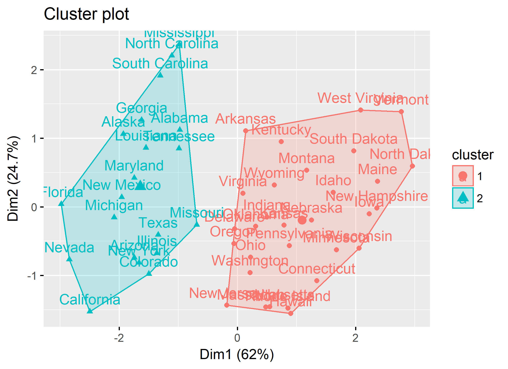
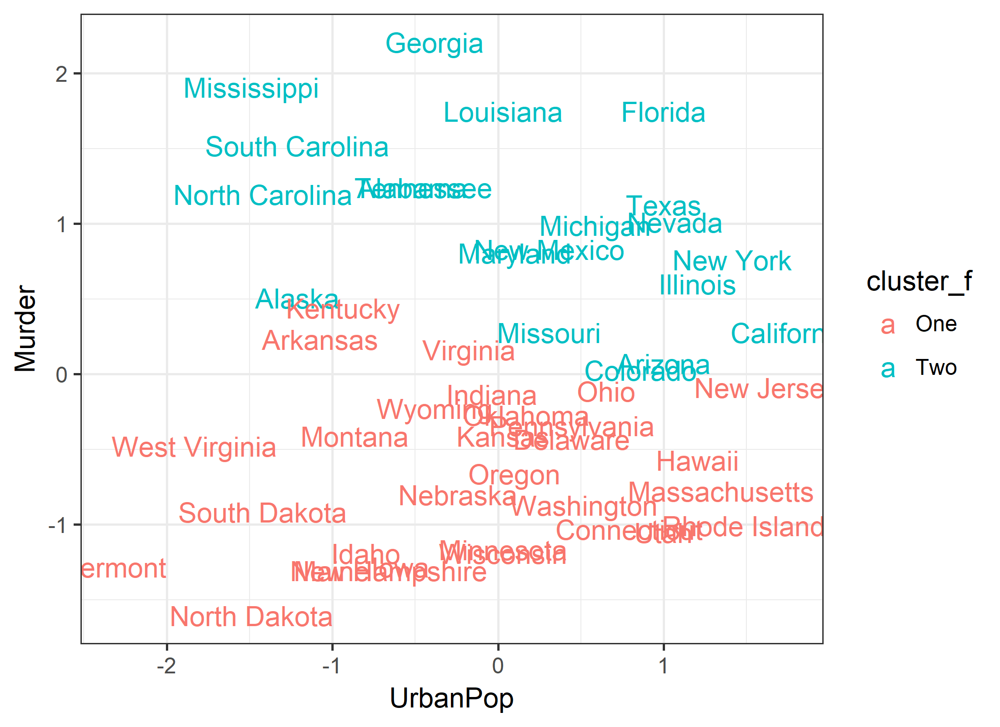
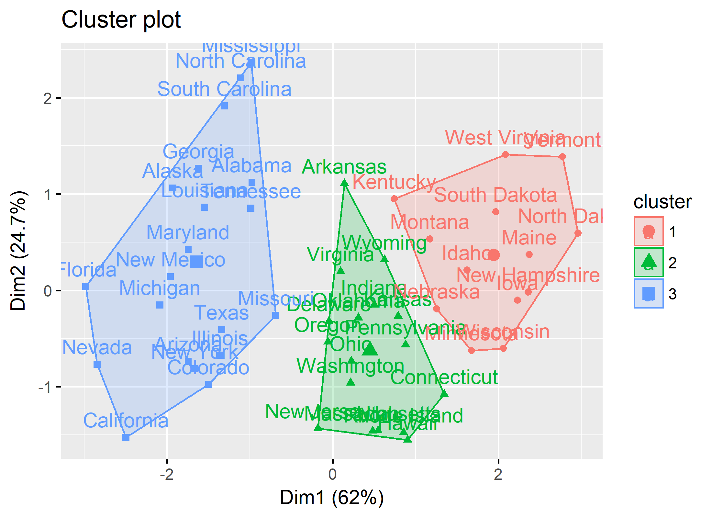
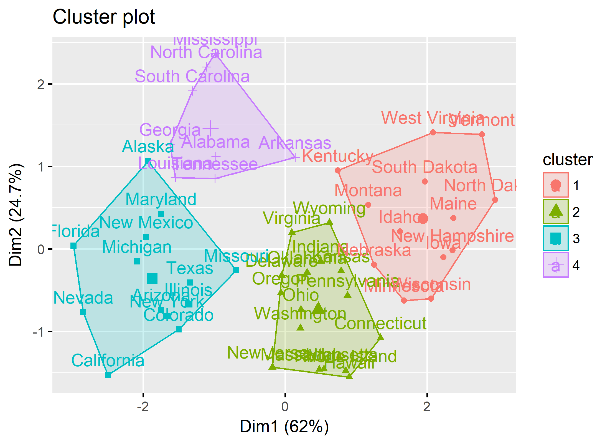

This documents offers a commentary on the [K-Means Cluster Analysis][kmeans] guide by [Bradley Boehmke][boehmke]. Taking advantage of Bradley's excellent coverage of the theory, we would like to focus on syntactic and operational features of the analytic workflow. 

[kmeans]:http://uc-r.github.io/kmeans_clustering
[boehmke]:http://uc-r.github.io/


<!-- These two chunks should be added in the beginning of every .Rmd that you want to source an .R script -->
<!--  The 1st mandatory chunck  -->
<!--  Set the working directory to the repository's base directory -->


<!--  The 2nd mandatory chunck  -->
<!-- Set the report-wide options, and point to the external code file. -->


<!-- Load the sources.  Suppress the output when loading sources. --> 

# I. Exposition

## Glossary
Review object definitions to assist you in reading the report. 
<!-- Load any Global functions and variables declared in the R file.  Suppress the output. --> 

```r
# define output format for the report
options(
  # knitr.table.format = "html"
  knitr.table.format = "pandoc"
  ,tibble.width = 110
  ,digits = 2
  #   ,bootstrap_options = c("striped", "hover", "condensed","responsive") # when using neat()
)
# html_flip <- TRUE  #  HTML   is the default format for printing tables
html_flip <- FALSE #  PANDOC is the default format for printing tables
# must provide a value if to use basic_features() function
```

Review functions definitions to assist you in reading the report.


<!-- Declare any global functions specific to a Rmd output.  Suppress the output. --> 


## Load Data
<!-- Load the datasets.   -->

```r
df0 <- datasets::USArrests
```

<!-- Inspect the datasets.   -->


## Data Tweaks
<!-- Tweak the datasets.   -->

```r
# remove missing values
df1 <- df0 %>% na.omit() 

# standardize variables 
df2 <- df1 %>% base::scale() 

# pre-wrangle for easier graphing
df3 <- df2 %>% 
  base::as.data.frame() %>% # if omit this step rownames will be lost
  tibble::as_tibble() %>%
  tibble::rownames_to_column("State")
```

## Basic Table

```r
df1 %>% head() %>% neat()
```

              Murder   Assault   UrbanPop   Rape
-----------  -------  --------  ---------  -----
Alabama         13.2       236         58     21
Alaska          10.0       263         48     44
Arizona          8.1       294         80     31
Arkansas         8.8       190         50     20
California       9.0       276         91     41
Colorado         7.9       204         78     39

```r
# df2 is the input into the estimation routine
df2 %>% head() %>% neat()
```

              Murder   Assault   UrbanPop    Rape
-----------  -------  --------  ---------  ------
Alabama         1.24      0.78      -0.52    0.00
Alaska          0.51      1.11      -1.21    2.48
Arizona         0.07      1.48       1.00    1.04
Arkansas        0.23      0.23      -1.07   -0.18
California      0.28      1.26       1.76    2.07
Colorado        0.03      0.40       0.86    1.86

```r
# it has some additional attributes
attr(df2,"scaled:center")
```

```
  Murder  Assault UrbanPop     Rape 
     7.8    170.8     65.5     21.2 
```

```r
attr(df2,"scaled:scale")
```

```
  Murder  Assault UrbanPop     Rape 
     4.4     83.3     14.5      9.4 
```


```r
# df3 is a tibbled df2, pre-wrangled for easier graphing
df3 %>% head() %>% neat()
```

     State         Murder   Assault   UrbanPop    Rape
---  -----------  -------  --------  ---------  ------
1    Alabama         1.24      0.78      -0.52    0.00
2    Alaska          0.51      1.11      -1.21    2.48
3    Arizona         0.07      1.48       1.00    1.04
4    Arkansas        0.23      0.23      -1.07   -0.18
5    California      0.28      1.26       1.76    2.07
6    Colorado        0.03      0.40       0.86    1.86

```r
print(neat) # function to add style to tables
```

```
function(x, html = html_flip , ...){
  # browser()
  # knitr.table.format = output_format
  if(!html){
    x_t <- knitr::kable(x, format = "pandoc", row.names = T,...)
  }else{
    x_t <- x %>%
      # x %>%
      # knitr::kable() %>%
      knitr::kable(format="html",row.names = F, ...) %>%
      kableExtra::kable_styling(
        bootstrap_options = c("striped", "hover", "condensed","responsive"),
        # bootstrap_options = c( "condensed"),
        full_width = F,
        position = "left"
      )
  }
  return(x_t)
}
<bytecode: 0x14b91f70>
```

```r
print(neat_DT) # function to style dynamic tables
```

```
function(x, filter_="top"){
  
  xt <- x %>%
    as.data.frame() %>% 
    DT::datatable(
      class   = 'cell-border stripe'
      ,filter  = filter_
      ,options = list(
        pageLength = 6,
        autoWidth  = FALSE
      )
    )
  return(xt)
}
```

```r
df3 %>% neat_DT() # watch out for size and security
```

<!--html_preserve--><div id="htmlwidget-9ee4acbc85a8d2c9fa70" style="width:100%;height:auto;" class="datatables html-widget"></div>
<script type="application/json" data-for="htmlwidget-9ee4acbc85a8d2c9fa70">{"x":{"filter":"top","filterHTML":"<tr>\n  <td><\/td>\n  <td data-type=\"character\" style=\"vertical-align: top;\">\n    <div class=\"form-group has-feedback\" style=\"margin-bottom: auto;\">\n      <input type=\"search\" placeholder=\"All\" class=\"form-control\" style=\"width: 100%;\"/>\n      <span class=\"glyphicon glyphicon-remove-circle form-control-feedback\"><\/span>\n    <\/div>\n  <\/td>\n  <td data-type=\"number\" style=\"vertical-align: top;\">\n    <div class=\"form-group has-feedback\" style=\"margin-bottom: auto;\">\n      <input type=\"search\" placeholder=\"All\" class=\"form-control\" style=\"width: 100%;\"/>\n      <span class=\"glyphicon glyphicon-remove-circle form-control-feedback\"><\/span>\n    <\/div>\n    <div style=\"display: none; position: absolute; width: 200px;\">\n      <div data-min=\"-1.60440462272012\" data-max=\"2.20685993611703\" data-scale=\"15\"><\/div>\n      <span style=\"float: left;\"><\/span>\n      <span style=\"float: right;\"><\/span>\n    <\/div>\n  <\/td>\n  <td data-type=\"number\" style=\"vertical-align: top;\">\n    <div class=\"form-group has-feedback\" style=\"margin-bottom: auto;\">\n      <input type=\"search\" placeholder=\"All\" class=\"form-control\" style=\"width: 100%;\"/>\n      <span class=\"glyphicon glyphicon-remove-circle form-control-feedback\"><\/span>\n    <\/div>\n    <div style=\"display: none; position: absolute; width: 200px;\">\n      <div data-min=\"-1.50904163534684\" data-max=\"1.99477641110098\" data-scale=\"15\"><\/div>\n      <span style=\"float: left;\"><\/span>\n      <span style=\"float: right;\"><\/span>\n    <\/div>\n  <\/td>\n  <td data-type=\"number\" style=\"vertical-align: top;\">\n    <div class=\"form-group has-feedback\" style=\"margin-bottom: auto;\">\n      <input type=\"search\" placeholder=\"All\" class=\"form-control\" style=\"width: 100%;\"/>\n      <span class=\"glyphicon glyphicon-remove-circle form-control-feedback\"><\/span>\n    <\/div>\n    <div style=\"display: none; position: absolute; width: 200px;\">\n      <div data-min=\"-2.31713632003554\" data-max=\"1.75892339618678\" data-scale=\"15\"><\/div>\n      <span style=\"float: left;\"><\/span>\n      <span style=\"float: right;\"><\/span>\n    <\/div>\n  <\/td>\n  <td data-type=\"number\" style=\"vertical-align: top;\">\n    <div class=\"form-group has-feedback\" style=\"margin-bottom: auto;\">\n      <input type=\"search\" placeholder=\"All\" class=\"form-control\" style=\"width: 100%;\"/>\n      <span class=\"glyphicon glyphicon-remove-circle form-control-feedback\"><\/span>\n    <\/div>\n    <div style=\"display: none; position: absolute; width: 200px;\">\n      <div data-min=\"-1.48744693897634\" data-max=\"2.64435011373571\" data-scale=\"15\"><\/div>\n      <span style=\"float: left;\"><\/span>\n      <span style=\"float: right;\"><\/span>\n    <\/div>\n  <\/td>\n<\/tr>","data":[["1","2","3","4","5","6","7","8","9","10","11","12","13","14","15","16","17","18","19","20","21","22","23","24","25","26","27","28","29","30","31","32","33","34","35","36","37","38","39","40","41","42","43","44","45","46","47","48","49","50"],["Alabama","Alaska","Arizona","Arkansas","California","Colorado","Connecticut","Delaware","Florida","Georgia","Hawaii","Idaho","Illinois","Indiana","Iowa","Kansas","Kentucky","Louisiana","Maine","Maryland","Massachusetts","Michigan","Minnesota","Mississippi","Missouri","Montana","Nebraska","Nevada","New Hampshire","New Jersey","New Mexico","New York","North Carolina","North Dakota","Ohio","Oklahoma","Oregon","Pennsylvania","Rhode Island","South Carolina","South Dakota","Tennessee","Texas","Utah","Vermont","Virginia","Washington","West Virginia","Wisconsin","Wyoming"],[1.24256408388112,0.507862482177576,0.0716334061660956,0.232349381538747,0.278268231645218,0.0257145560596241,-1.03041899638922,-0.433473945005092,1.74767143505231,2.20685993611703,-0.571230495324507,-1.19113497176187,0.59970018239052,-0.135001419313027,-1.28297267197482,-0.410514519951857,0.438984207017869,1.74767143505231,-1.30593209702805,0.806335007869642,-0.77786532080363,0.990010408295529,-1.16817554670864,1.90838741042496,0.278268231645218,-0.410514519951857,-0.800824745856866,1.01296983334876,-1.30593209702805,-0.089082569206555,0.829294432922878,0.76041615776317,1.19664523377465,-1.60440462272012,-0.112041994259791,-0.272757969632442,-0.663068195537451,-0.341636244792149,-1.00745957133599,1.51807718451995,-0.915621871123045,1.24256408388112,1.12776695861494,-1.05337842144246,-1.28297267197482,0.163471106379039,-0.869703021016573,-0.479392795111564,-1.19113497176187,-0.22683911952597],[0.782839347089918,1.10682252261763,1.47880320563092,0.230868011005672,1.26281442194578,0.398859287205225,-0.729082138706061,0.806838100832712,1.97077765735819,0.482854925305002,-1.49704225847545,-0.609088369992094,0.938831246418075,-0.693084008091871,-1.37704848976148,-0.669085254349078,-0.741081515577458,0.938831246418075,-1.05306531423377,1.5507994668593,-0.261106440721591,1.01082750764645,-1.18505845981913,1.05882501513204,0.0868754885489119,-0.741081515577458,-0.825077153677234,0.974829377032265,-1.36504911289008,-0.141112672007625,1.37080881378835,0.998828130775058,1.99477641110098,-1.50904163534684,-0.609088369992094,-0.237107686978798,-0.141112672007625,-0.777079646191648,0.0388779810633253,1.29881255255997,-1.01706718361958,0.206869257262879,0.362861156591035,-0.609088369992094,-1.47304350473265,-0.177110802621815,-0.309103948207178,-1.07706406797656,-1.41304662037567,-0.117113918264831],[-0.520906614581632,-1.21176419360236,0.998980059263978,-1.07359267779822,1.75892339618678,0.860808543459832,0.791722785557759,0.446293996047393,0.998980059263978,-0.382735098777486,1.2062373329702,-0.797249646189925,1.2062373329702,-0.03730630926712,-0.589992372483706,0.0317794486349532,-0.935421161994072,0.0317794486349532,-1.00450691989614,0.100865206537026,1.34440884877434,0.584465511851539,0.0317794486349532,-1.48810722521066,0.308122480243246,-0.866335404091998,-0.24456358297334,1.06806581716605,-0.659078130385779,1.62075188038264,0.308122480243246,1.41349460667642,-1.41902146730858,-1.48810722521066,0.653551269753612,0.1699509644391,0.100865206537026,0.446293996047393,1.48258036457849,-1.21176419360236,-1.41902146730858,-0.451820856679559,0.998980059263978,0.998980059263978,-2.31713632003554,-0.175477825071266,0.515379753949466,-1.83353601472102,0.0317794486349532,-0.382735098777486],[-0.00341647301516242,2.48420294114997,1.04287838787833,-0.184916601945666,2.06782029242705,1.86496720715179,-1.0817407684258,-0.579946294323821,1.13896669142977,0.487701522914436,-0.110181254738988,-0.750769945081942,0.295524915811549,-0.0247694293599275,-1.06038781208104,-0.345063774531404,-0.526563903461908,0.103348308708663,-1.43406454811443,0.701231086362087,-0.526563903461908,1.48061399294601,-0.676034597875264,-0.441152078082847,0.743936999051617,-0.515887425289525,-0.505210947117143,2.64435011373571,-1.25256441918392,-0.259651949152344,1.16031964777454,0.519730957431583,-0.547916859806673,-1.48744693897634,0.0179364833296026,-0.131534211083753,0.861378258947825,-0.676034597875264,-1.38068215725251,0.135377743225811,-0.900240639495297,0.605142782810643,0.455672088397288,0.178083655915341,-1.07106429025342,-0.0567988638770752,0.530407435603966,-1.27391737552869,-1.11377020294295,-0.601299250668586]],"container":"<table class=\"cell-border stripe\">\n  <thead>\n    <tr>\n      <th> <\/th>\n      <th>State<\/th>\n      <th>Murder<\/th>\n      <th>Assault<\/th>\n      <th>UrbanPop<\/th>\n      <th>Rape<\/th>\n    <\/tr>\n  <\/thead>\n<\/table>","options":{"pageLength":6,"autoWidth":false,"columnDefs":[{"className":"dt-right","targets":[2,3,4,5]},{"orderable":false,"targets":0}],"order":[],"orderClasses":false,"orderCellsTop":true,"lengthMenu":[6,10,25,50,100]}},"evals":[],"jsHooks":[]}</script><!--/html_preserve-->


## Basic Graph

```r
g1 <- df3 %>% 
  ggplot2::ggplot(
    aes_string(
      x     = "Murder"
      ,y    = "Assault"
      ,size = "Rape"
      ,fill = "UrbanPop"
    )
  )+
  geom_point(shape = 21, color = "black", alpha = .5)+
  theme_bw()
g1
```



```r
# we can make this graph a bit easier to explore data with if we express it as a function
make_basic_scatter <- function(d,x_,y_,size_,fill_){
  g1 <- d %>%
    ggplot2::ggplot(
      aes_string(
        x     = x_
        ,y    = y_
        ,size = size_
        ,fill = fill_
      )
    )+
    geom_point(shape = 21, color = "black", alpha = .5)+
    theme_bw()
  return(g1)
}
# usage
df3 %>% make_basic_scatter("Assault", "Rape", "Murder", "UrbanPop") 
```



```r
# this function become useful if we want to cycle through possible combination
df3 %>% make_basic_scatter("Rape", "UrbanPop", "Assault", "Murder") 
```



```r
# df3 %>% make_basic_scatter("Murder", "Assault", "Rape", "UrbanPop") 
# df3 %>% make_basic_scatter("Assault", "Murder", "Rape", "UrbanPop") 
# df3 %>% make_basic_scatter("Rape", "Assault", "Murder", "UrbanPop") 
```

# II. Development A


First, we must produce **distance matrix**, the basis for the upcoming clustering 


## A1 - Distance

```r
distance <- df2 %>% factoextra::get_dist()

g2 <- distance %>% fviz_dist(
  gradient = list(
       low  = "#00AFBB"
      ,mid  = "white"
      ,high = "#FC4E07"
      )
  )
g2 %>% print()
```



```r
k2 <- df2 %>% stats::kmeans(
   centers = 2  # number of clusters to search for
  ,nstart  = 25 # number of initial configurations to attempt
  )
k2 %>% print()
```

```
K-means clustering with 2 clusters of sizes 20, 30

Cluster means:
  Murder Assault UrbanPop  Rape
1   1.00    1.01     0.20  0.85
2  -0.67   -0.68    -0.13 -0.56

Clustering vector:
       Alabama         Alaska        Arizona       Arkansas     California       Colorado    Connecticut       Delaware 
             1              1              1              2              1              1              2              2 
       Florida        Georgia         Hawaii          Idaho       Illinois        Indiana           Iowa         Kansas 
             1              1              2              2              1              2              2              2 
      Kentucky      Louisiana          Maine       Maryland  Massachusetts       Michigan      Minnesota    Mississippi 
             2              1              2              1              2              1              2              1 
      Missouri        Montana       Nebraska         Nevada  New Hampshire     New Jersey     New Mexico       New York 
             1              2              2              1              2              2              1              1 
North Carolina   North Dakota           Ohio       Oklahoma         Oregon   Pennsylvania   Rhode Island South Carolina 
             1              2              2              2              2              2              2              1 
  South Dakota      Tennessee          Texas           Utah        Vermont       Virginia     Washington  West Virginia 
             2              1              1              2              2              2              2              2 
     Wisconsin        Wyoming 
             2              2 

Within cluster sum of squares by cluster:
[1] 47 56
 (between_SS / total_SS =  47.5 %)

Available components:

[1] "cluster"      "centers"      "totss"        "withinss"     "tot.withinss" "betweenss"    "size"        
[8] "iter"         "ifault"      
```

```r
# structcure of the estimated object
k2 %>% str()
```

```
List of 9
 $ cluster     : Named int [1:50] 1 1 1 2 1 1 2 2 1 1 ...
  ..- attr(*, "names")= chr [1:50] "Alabama" "Alaska" "Arizona" "Arkansas" ...
 $ centers     : num [1:2, 1:4] 1.005 -0.67 1.014 -0.676 0.198 ...
  ..- attr(*, "dimnames")=List of 2
  .. ..$ : chr [1:2] "1" "2"
  .. ..$ : chr [1:4] "Murder" "Assault" "UrbanPop" "Rape"
 $ totss       : num 196
 $ withinss    : num [1:2] 46.7 56.1
 $ tot.withinss: num 103
 $ betweenss   : num 93.1
 $ size        : int [1:2] 20 30
 $ iter        : int 1
 $ ifault      : int 0
 - attr(*, "class")= chr "kmeans"
```

```r
k2$centers        # A matrix of cluster centers.
```

```
  Murder Assault UrbanPop  Rape
1   1.00    1.01     0.20  0.85
2  -0.67   -0.68    -0.13 -0.56
```

```r
k2$totss          # The total sum of squares.
```

```
[1] 196
```

```r
k2$withinss       # Vector of within-cluster sum of squares, one component per cluster.
```

```
[1] 47 56
```

```r
k2$tot.withinss   # Total within-cluster sum of squares, i.e. sum(withinss).
```

```
[1] 103
```

```r
k2$betweenss      # The between-cluster sum of squares, i.e. $totss-tot.withinss$.
```

```
[1] 93
```

```r
k2$size           # The number of points in each cluster.
```

```
[1] 20 30
```

## A2 - Cluster Scatter

```r
# factoextra() give generic tools for viewing objects produced by stats::kmeans()
g3 <- k2 %>% factoextra::fviz_cluster(data = df2)
g3 %>% print()
```



```r
# factoextra() is great for initial review
# to visualize the data it retains only the first two of the eigen dimensions
# solution to that is provided by stats::prcomp() function, selection the top two principle components
# if we want to increase the number of dimensions or rotate the solutions
# we should either extract the  stats::prcomp() results or replicate them.(TODO)
```

## A3 - Customized CS

```r
# let us practice adding the solution of the model to the original dataframe
# this gives us flexibility to visualize the results 
g4 <- 
  # data section
  # dplyr::mutate(cluster = k2$cluster) # this is a soft join, it expects that two objects will be sorted in the same way. 
  # This join is not desirable, as it may introduce hard-to-trace error
  # instead, use the proper join that identifies explicitely the joining key
  dplyr::left_join(
    # the first  dataframe to be joined 
     df3
    # the second dataframe to be joined
    ,k2$cluster %>% 
      tibble::as_tibble() %>% 
      tibble::rownames_to_column("State") %>% 
      dplyr::rename("cluster" = "value")
    # by clause
    , by = "State"
  ) %>% 
  dplyr::mutate(
    cluster_f = factor(cluster, levels = c("1","2"), labels = c("One", "Two"))
  ) %>% 
  # graphing section
  ggplot2::ggplot(
    aes_string(
       x     = "UrbanPop"
      ,y     = "Murder"
      ,color = "cluster_f"
      ,label = "State")
    ) +
  geom_text()+
  theme_bw()
g4 %>% print()
```



## A4 - Looping

```r
# we would like to obtain solutions for a variety of n-dimensional spaces
# let us design functions to implement computation and organize components of the workflow

# the first, most outer layer of the loop will cycle through number of possible dimentions in the solution space
ls_solutions <- list()
for(k in 2:3){
  # k <- 3 # for testing and development
  n_dim <- paste0(k)
  ls_solutions[[n_dim]][["distance"]] <- 
    df2 %>% 
    stats::kmeans(
      centers = k  # number of clusters to search for
      ,nstart  = 25 # number of initial configurations to attempt
    )
  ls_solutions[[n_dim]][["solution"]] <- 
    dplyr::left_join(
      # the first  dataframe to be joined 
      df3
      # the second dataframe to be joined
      ,ls_solutions[[paste0(k)]][["distance"]][["cluster"]] %>% 
        tibble::as_tibble() %>% 
        tibble::rownames_to_column("State") %>% 
        dplyr::rename("cluster" = "value")
      # by clause
      , by = "State"
    ) 
  ls_solutions[[n_dim]][["graph0"]] <-  
    ls_solutions[[n_dim]][["distance"]] %>%  
    factoextra::fviz_cluster(data = df2)
}
ls_solutions$`3`$graph0
```



## A5 - Automation

```r
# we can package this loop in a function, so that process becomes a bit more controlled
# it is also useful for expanding the contents of the loop

conduct_kmeans_basic <- function(
  d # missing removed, standardized
  ,n_cluster
){
  # d <- df2
  # basic pre-wrangling for solution extraction
  d1 <- d %>% 
    base::as.data.frame() %>% 
    tibble::rownames_to_column("State")
  
  ls_sol <- list() # create a shell to popoulate

  ls_sol[["distance"]] <- 
    d %>% 
    stats::kmeans(
      centers = k  # number of clusters to search for
      ,nstart  = 25 # number of initial configurations to attempt
    )
  ls_sol[["solution"]] <- 
    dplyr::left_join(
      # the first  dataframe to be joined 
      d1
      # the second dataframe to be joined
      ,ls_sol[["distance"]][["cluster"]] %>% 
        tibble::as_tibble() %>% 
        tibble::rownames_to_column("State") %>% 
        dplyr::rename("cluster" = "value")
      # the by clause
      , by = "State"
    ) 
  ls_sol[["graph0"]] <-  
    ls_sol[["distance"]] %>%  
    factoextra::fviz_cluster(data = d)
  
  return(ls_sol)
}
# usage
# ls_sol <- df2 %>% conduct_kmeans_basic(n_cluster = 3)
# lapply(ls_sol, names)  
```

## A6 - New Looping

```r
# now we can use this general function to populate the loop more flexibly
ls_solutions <- list()
for(k in 2:6){
  ls_solutions[[paste0(k)]] <- df2 %>% conduct_kmeans_basic(n_cluster = k)
}
lapply(ls_solutions, names)
```

```
$`2`
[1] "distance" "solution" "graph0"  

$`3`
[1] "distance" "solution" "graph0"  

$`4`
[1] "distance" "solution" "graph0"  

$`5`
[1] "distance" "solution" "graph0"  

$`6`
[1] "distance" "solution" "graph0"  
```

```r
ls_solutions$`3`$distance
```

```
K-means clustering with 3 clusters of sizes 13, 17, 20

Cluster means:
  Murder Assault UrbanPop  Rape
1  -0.96   -1.11    -0.93 -0.97
2  -0.45   -0.35     0.48 -0.26
3   1.00    1.01     0.20  0.85

Clustering vector:
       Alabama         Alaska        Arizona       Arkansas     California       Colorado    Connecticut       Delaware 
             3              3              3              2              3              3              2              2 
       Florida        Georgia         Hawaii          Idaho       Illinois        Indiana           Iowa         Kansas 
             3              3              2              1              3              2              1              2 
      Kentucky      Louisiana          Maine       Maryland  Massachusetts       Michigan      Minnesota    Mississippi 
             1              3              1              3              2              3              1              3 
      Missouri        Montana       Nebraska         Nevada  New Hampshire     New Jersey     New Mexico       New York 
             3              1              1              3              1              2              3              3 
North Carolina   North Dakota           Ohio       Oklahoma         Oregon   Pennsylvania   Rhode Island South Carolina 
             3              1              2              2              2              2              2              3 
  South Dakota      Tennessee          Texas           Utah        Vermont       Virginia     Washington  West Virginia 
             1              3              3              2              1              2              2              1 
     Wisconsin        Wyoming 
             1              2 

Within cluster sum of squares by cluster:
[1] 12 20 47
 (between_SS / total_SS =  60.0 %)

Available components:

[1] "cluster"      "centers"      "totss"        "withinss"     "tot.withinss" "betweenss"    "size"        
[8] "iter"         "ifault"      
```

```r
ls_solutions$`3`$solution %>% head(10) %>% neat()
```

     State          Murder   Assault   UrbanPop    Rape   cluster
---  ------------  -------  --------  ---------  ------  --------
1    Alabama          1.24      0.78      -0.52    0.00         3
2    Alaska           0.51      1.11      -1.21    2.48         3
3    Arizona          0.07      1.48       1.00    1.04         3
4    Arkansas         0.23      0.23      -1.07   -0.18         2
5    California       0.28      1.26       1.76    2.07         3
6    Colorado         0.03      0.40       0.86    1.86         3
7    Connecticut     -1.03     -0.73       0.79   -1.08         2
8    Delaware        -0.43      0.81       0.45   -0.58         2
9    Florida          1.75      1.97       1.00    1.14         3
10   Georgia          2.21      0.48      -0.38    0.49         3

```r
ls_solutions$`2`$graph0
```


```r
ls_solutions$`3`$graph0
```


```r
ls_solutions$`4`$graph0
```



```r
# now we can package routine operations into a single function
```


# III. Development B


## B1


## B2


## B3


## B4


## B5


# IV. Recap


```
Report rendered by Andriy at 2018-08-08, 07:13 -0700
```

```
R version 3.5.0 (2018-04-23)
Platform: i386-w64-mingw32/i386 (32-bit)
Running under: Windows >= 8 x64 (build 9200)

Matrix products: default

locale:
[1] LC_COLLATE=English_United States.1252  LC_CTYPE=English_United States.1252    LC_MONETARY=English_United States.1252
[4] LC_NUMERIC=C                           LC_TIME=English_United States.1252    

attached base packages:
[1] grid      stats     graphics  grDevices utils     datasets  methods   base     

other attached packages:
 [1] bindrcpp_0.2.2     RColorBrewer_1.1-2 dichromat_2.0-0    extrafont_0.17     factoextra_1.0.5   kableExtra_0.8.0  
 [7] knitr_1.20         rmarkdown_1.9      dplyr_0.7.4        magrittr_1.5       ggplot2_2.2.1      cluster_2.0.7-1   

loaded via a namespace (and not attached):
 [1] jsonlite_1.5      reshape2_1.4.3    rstudioapi_0.7    gtable_0.2.0      hms_0.4.2         xml2_1.2.0       
 [7] utf8_1.1.3        pillar_1.2.2      htmltools_0.3.6   ggrepel_0.8.0     stringr_1.3.0     later_0.7.1      
[13] htmlwidgets_1.2   plyr_1.8.4        mime_0.5          pkgconfig_2.0.1   R6_2.2.2          shiny_1.0.5      
[19] digest_0.6.15     colorspace_1.3-2  rprojroot_1.3-2   DT_0.4            stringi_1.1.7     yaml_2.1.19      
[25] lazyeval_0.2.1    crosstalk_1.0.0   evaluate_0.10.1   ggpubr_0.1.7      labeling_0.3      testit_0.7       
[31] tibble_1.4.2      httr_1.3.1        compiler_3.5.0    bindr_0.1.1       cli_1.0.0         backports_1.1.2  
[37] xtable_1.8-2      munsell_0.4.3     Rcpp_0.12.16      highr_0.6         Rttf2pt1_1.3.6    assertthat_0.2.0 
[43] readr_1.1.1       tools_3.5.0       extrafontdb_1.0   httpuv_1.4.1      viridisLite_0.3.0 scales_0.5.0     
[49] crayon_1.3.4      glue_1.2.0        purrr_0.2.4       rlang_0.2.0       promises_1.0.1    rvest_0.3.2      
```


